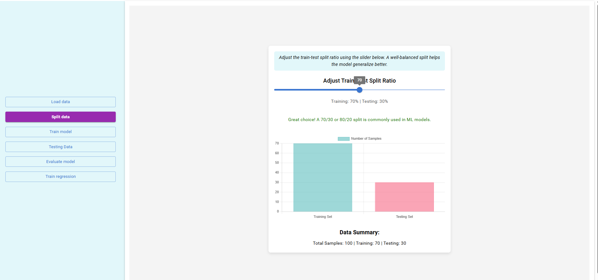
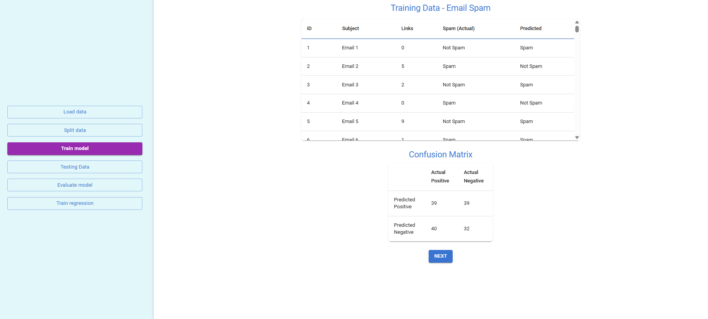
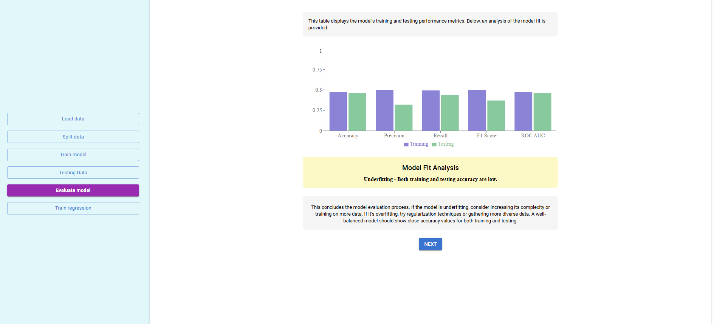

Select a dataset from the dropdown, then click the "Load Data" button to load the dataset.

Adjust the train-test split ratio using the slider below.

Observe the training dataset and confusion matrices based on the training.

Observe the testing dataset, confusion matrices, and the performance metrics analysis.

Click the "Compare Training vs Testing" button to view the comparison of training and testing values. Observe the model fit analysis based on the comparison.

Observe the Linear Regression model to predict salaries based on years of experience. Enter a value to see the predicted salary. Observe the Model Evaluation values.

