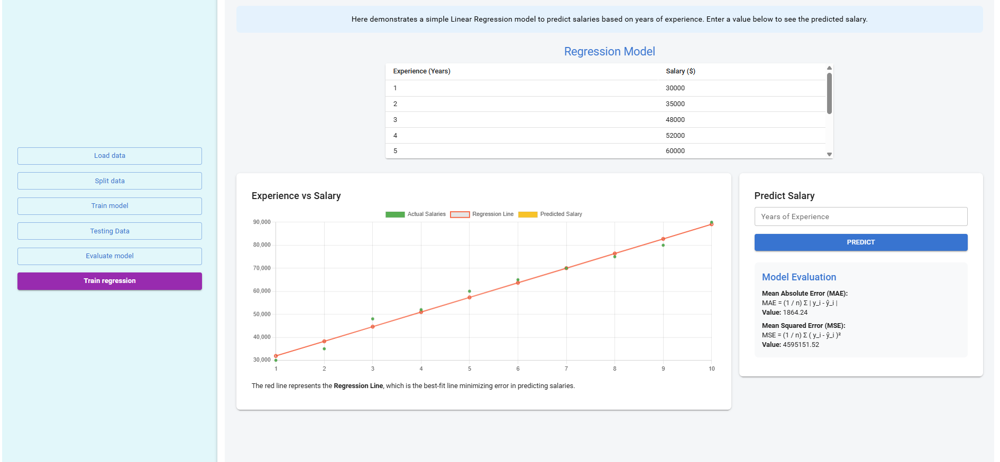

### Procedure

Select a dataset from the dropdown ,click load data button to load the dataset 

Adjust the train-test split ratio using the slider below.

observe the trainign dataset,confusion matrics baded on the  training

observe the testing dataset confution matrcis and the perfomance matrics analysis

click the  compare the trainign vs testing button to view the comaperosn and traing and testing value,observe the model fit analysis based on the comparison

Observe the Linear Regression model to predict salaries based on years of experience. Enter a value  to see the predicted salary.Observe the Model Evaluation values

