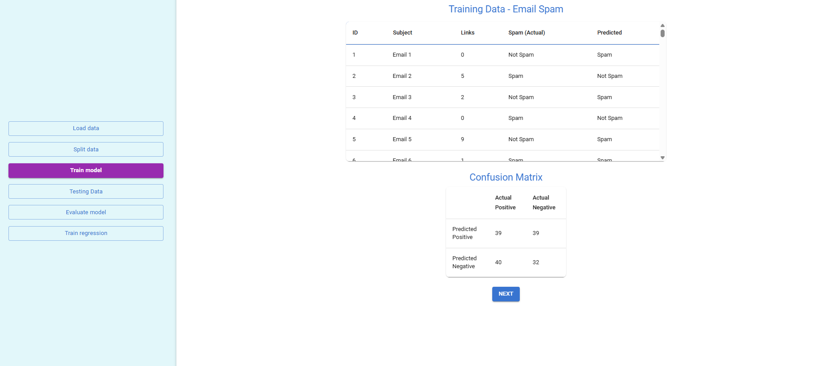

Select a dataset from the dropdown and click the <strong>Load Data</strong> button to load the dataset.

Adjust the train–test split ratio using the slider below.

Observe the training dataset and the confusion matrix based on the training results.

Observe the testing dataset, the confusion matrix, and the performance metrics analysis.

Click the <strong>Compare Training vs Testing</strong> button to view the comparison of training and testing values, and observe the model fit analysis based on this comparison.

Observe the Linear Regression model used to predict salaries based on years of experience. Enter a value to see the predicted salary and review the model evaluation metrics.

